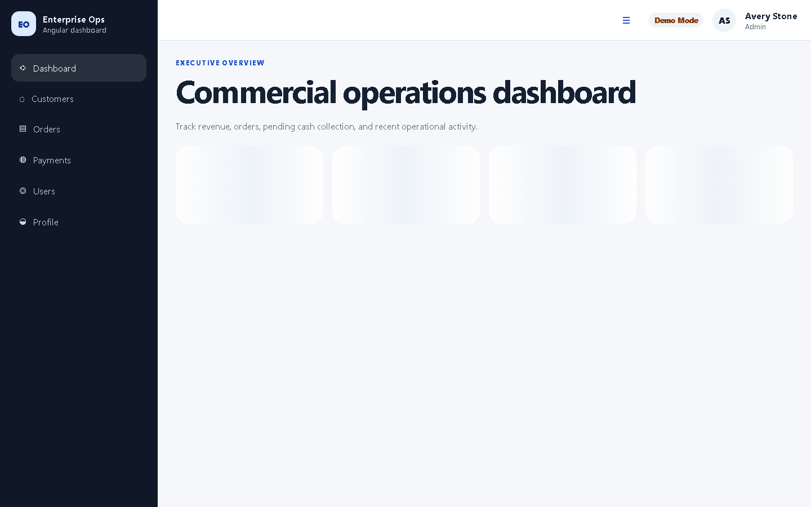
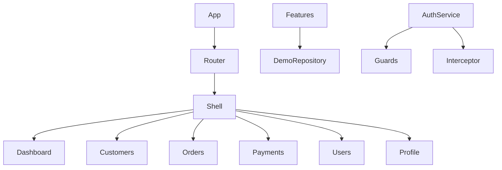

# Angular Enterprise Dashboard

Enterprise Angular dashboard with modern architecture, signals, typed demo/API boundary, role-based access, testing, accessibility, Docker and CI/CD.

> This repository is Project 2 of the professional portfolio series and is designed as a realistic foundation for internal B2B operations portals.

## Features



- Executive dashboard with KPIs and real ECharts visualizations.
- Customers, orders, payments, users, and profile areas.
- Demo authentication with roles and permissions.
- Route-level and action-level authorization examples.
- Light/dark theme preference persisted locally.
- Angular standalone components, signals, lazy loading, strict TypeScript.
- Playwright E2E with axe accessibility smoke test.
- Docker + Nginx SPA delivery with security headers.

## Demo accounts

All accounts are fictitious:

| Email                 | Role               |
| --------------------- | ------------------ |
| `admin@example.com`   | Admin              |
| `manager@example.com` | Operations Manager |
| `analyst@example.com` | Analyst            |

## Quick start

```bash
npm ci
npm start
```

Open `http://127.0.0.1:4200`.

## Validation

```bash
npm run format
npm run lint
npm run test:coverage -- --watch=false
npm run build
npm run e2e
```

## Architecture



See [`docs/ARCHITECTURE.md`](docs/ARCHITECTURE.md).

## Docker

```bash
docker build -t angular-enterprise-dashboard .
docker run --rm -p 8080:8080 angular-enterprise-dashboard
```

## Screenshots

- [Login](docs/images/login.png)
- [Dashboard desktop](docs/images/dashboard-desktop.png)
- [Customers list](docs/images/customers-list.png)
- [Dark profile](docs/images/profile-dark.png)
- [Mobile dashboard](docs/images/mobile-dashboard.png)

## Security

No real credentials are included. Frontend authorization improves user experience but does not replace server-side authorization. See [`docs/SECURITY.md`](docs/SECURITY.md).

## License

MIT © Diogo Barbosa
