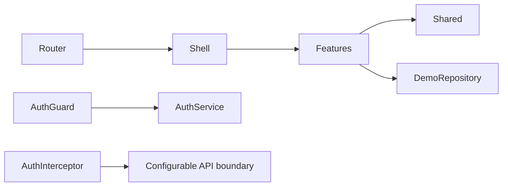

# Architecture

The application uses Angular standalone components, lazy-loaded routes, feature-oriented boundaries, and singleton infrastructure under `src/app/core`.

`core` owns authentication, runtime configuration, HTTP interception, demo data, and layout. `shared` owns reusable models and UI primitives. Features keep page-level state with signals and call a typed repository abstraction.
